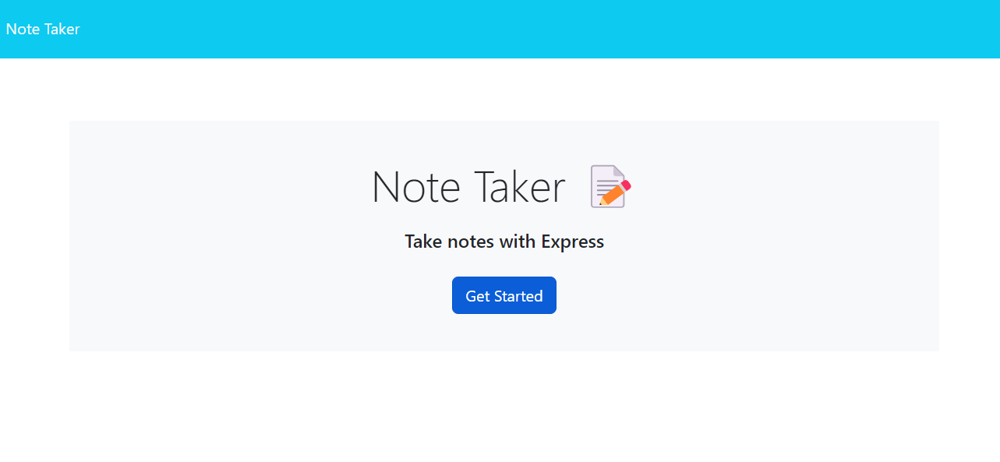
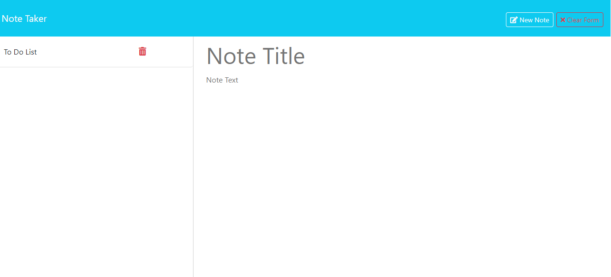
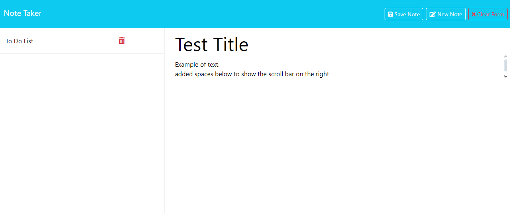
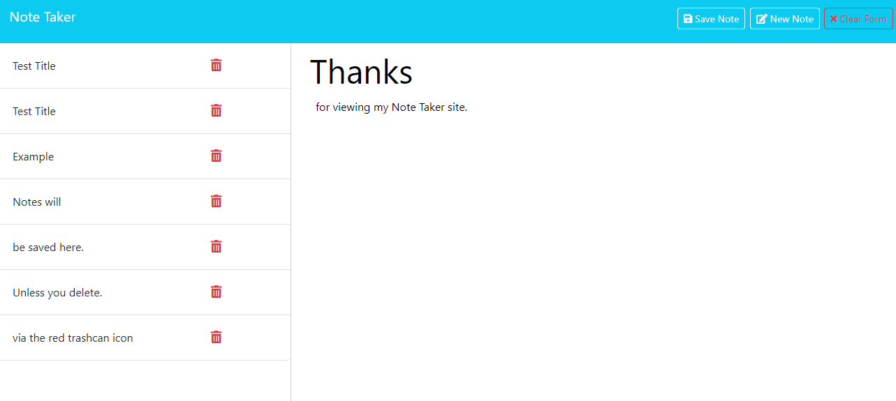

# NoteTakerChallenge11V2
An Online Note Taker.

# Table of Contents
- [Introduction and Usage](#introduction_and_usage)
- [Installation](#installation)
- [How to use](#how_to_use)
- [Links](#links)
- [Photos](#photos)
- [License](#license)
- [Credits](#credits)

# Introduction and Usage
A simple Render deployed Note Taker application for adding, saving, and deleting notes.

# Installation
Requires NPM Express, and NPM Uniqid, if using directly within Node if you want to make any edits or additions to the code, however for just usage simply follow the Render link below.

# How to use
- 1: Click the deployed Render link below which will take you to the website.
- 2: Click the Get Started button on the website.
- 3: Enter a title, and fill in any information you would like within the Note Text.
- 4: When you are done press the Save Note button.
- 5: Press New Note to create a new note or Clear Form.
- 6: A New Note will begin after saving the note.
- 7: If you no longer want a saved note, click the red trashcan icon to delete the note.

# Links
GitHub Repository.
https://github.com/ConnorLuks/NoteTakerChallenge11V2

Render link.
https://notetakerchallenge11v2.onrender.com/

# Photos
Main Page

Notes Page

Test of using Notes

Example of several saved Notes

# License
Distributed under the MIT license.

# Credits
Connor O'Halloran.
